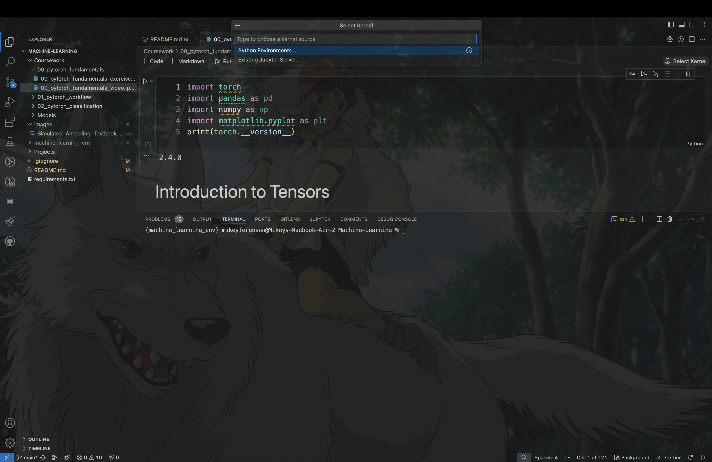

# About
This is a repository containing notebooks and machine learning models using the PyTorch Python library.

## Instructions
I would highly recommend using VSCode to experiment with these notebooks should one choose to do so. Download here: https://code.visualstudio.com/download<br>
These extensions are also MAD useful: https://marketplace.visualstudio.com/items?itemName=ms-toolsai.jupyter<br>
These instructions assume that one has "pip" installed on their pc. If that is not the case, see the following link for instructions on how to install pip: https://pip.pypa.io/en/stable/installation/<br>
I'm also going to assume you have Python installed:
https://www.python.org/downloads/<br>
Finally, I'm assuming you have "git" installed:
https://git-scm.com/book/en/v2/Getting-Started-Installing-Git<br>
To run these notebooks, perform the following tasks, which will include cloning this repository and creating a Python virtual environment containing the necessary libraries:
1. Navigate to a folder on your computer where you would like to clone this project via the command line and run the following command:<br>
   ```git clone https://github.com/Pirate-Hunter-Zoro/Machine-Learning.git```<br>
This will create a folder called "Machine-Learning" in your current folder. 
2. Navigate into this folder.<br>
   ```cd Machine-Learning```
3. Create a python virtual environment named "machine_learning_env" (or whatever you want to call it) via the following command:<br>
   ```python3.10 -m venv machine_learning_env```
4. Activate the virtual environment:<br>
   ```source machine_learning_env/bin/activate```
5. Install the necessary Python libraries:<br>
   ```pip install -r requirements.txt```
6. At this point feel free to open the repository in VSCode:<br>
   ```code .```
7. You should be able to open any notebook and navigate your mouse near the top right to click on the "Select Kernel" box, choose "Python Environments", and select the virtual environment you just created as a kernel:


8. Now have fun running the cells!

## Useful Note
To write all of the requirements in the Python virtual library into "requirements.txt", run the following command:<br>
```pip freeze > requirements.txt```

## Source
For those curious, I am following an online course:
https://zerotomastery.io/courses/learn-pytorch/